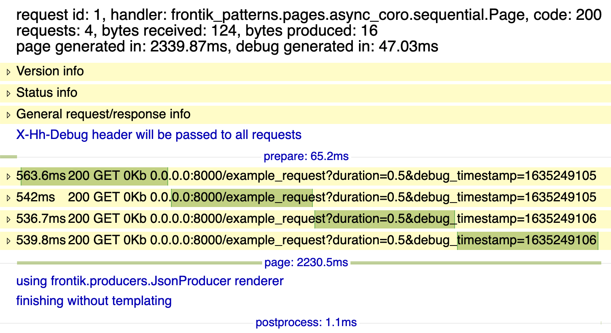

# Паттерны разработки для frontik-приложений

<a name="index"></a>
* [Запуск тестового проекта](#run)
* [Добавление своих примеров](#add_own)
* [http-клиент фронтика](#http_client)
* [Паттерны](#patterns)
  * [Нативные корутины `async def`](#native_coro)
    * [Последовательное выполнение](#native_coro_serial)
    * [Параллельное выполнение](#native_coro_parallel)
    * [Независимые задачи](#native_coro_task)
  * [Корутины tornado `@gen.coroutine`](#torando_coro)
    * [Последовательное выполнение](#tornado_coro_serial)
    * [Параллельное выполнение](#tornado_coro_parallel)
    * [Независимые задачи](#tornado_coro_task)
  * [Коллбеки tornado](#tornado_callback)
    * [Последовательное выполнение](#tornado_callback_serial)
    * [Параллельное выполнение](#tornado_callback_parallel)
    * [Независимые задачи](#tornado_callback_task)
    
<a name="run"></a>
## Запуск тестового проекта [^](#index "к оглавлению")

```console
python3 run.py
```

Затем нужно открыть в браузере http://0.0.0.0:8000, далее переходить по ссылкам.
В дебаг-режиме будет доступна временнáя диаграмма, где темно-зеленым цветом 
обозначены асинхронные http-походы в соответствии со временем выполнения.


*на скришоте дебаг-страница с 4-мя последовательными запросами одинаковой длительности*

<a name="add_own"></a>
## Добавление своих примеров [^](#index "к оглавлению")

Проект содержит страницу для выполнения примеров запросов `0.0.0.0:8000/example_request?duration=1`, 
где duration - продолжительность запроса в секундах. Хендлер 
[`example_request.py`](frontik_patterns/pages/example_request.py) 
содержит неблокирующий вызов `asyncio.sleep()`.

<a name="http_client"></a>
## http-клиент фронтика [^](#index "к оглавлению")

При использовании современных http-клиентов либо библиотек для работы с базами обычно подобные методы
возвращают корутины. При создании корутины-объекта из корутины-функции (вызов `coro()`) задача не ставится на выполнение сама - 
для этого мы должны заавейтить ее либо создать таску.

Давайте разберемся, что же представляют собой методы `get_url`, `post_url`, `put_url` и `delete_url` из фронтика.
1. Под капотом они пока еще реализованы на старых торнадовских коллбеках, и 
при вызове любого метода http-клиента запрос **сразу же** ставится на выполнение. Это аналог современных тасок.
2. Метод [возвращает](https://github.com/hhru/balancing-http-client/blob/cb28c444e50fd1de1b5354e9760f5019414880b0/http_client/__init__.py#L546-L570)
[`asyncio.Future`](https://docs.python.org/3/library/asyncio-future.html),
поэтому мы можем await'ить эту фьючу из 
[`AwaitablePageHandler`](https://github.com/hhru/frontik/blob/4b7588fa7c3f4363a80ac0dffc5435a6bf3f3e1d/frontik/handler.py#L89-L825) 
и yield'ить ее же из 
[`PageHandler`](https://github.com/hhru/frontik/blob/4b7588fa7c3f4363a80ac0dffc5435a6bf3f3e1d/frontik/handler.py#L89-L825),
дожидаясь результатов запроса для последующей обработки.
Фьюча является тем костылем по сути, который связывает коллбеки и корутины, нативные и торнадовские.
[Теория](https://github.com/vera-l/python-meetups/blob/master/02-asyncio/README.md)

```python
future = handler.get_url(
    some_host,
    '/path/to/resource',
    data=data,
    headers=headers,
)
result = await future
```

В коде старых проектов вместо `yield` либо `await` используется аргумент `callback` (чтобы обработать результат запроса),
который не рекомендуется в современном коде. 

```python
def cb(xml, response):
    if xml is None or response.error:
        raise HTTPError(response.code)
    handler.doc.put(xml)

handler.get_url(
    some_host,
    '/path/to/resource',
    data=data,
    headers=headers,
    callback=cb,
)
```

Если при вызове http-метода не указывать флаг `waited=False`, то фьюча 
[добавится](https://github.com/hhru/frontik/blob/f613b4c4314302859bbd485e56adca259d6dc22c/frontik/handler.py#L822-L823) 
в `handler.finish_group` и 
[гарантированно выполнится](https://github.com/hhru/frontik/blob/f613b4c4314302859bbd485e56adca259d6dc22c/frontik/handler.py#L350) 
до отдачи ответа.


<a name="patterns"></a>
## Паттерны [^](#index "к оглавлению")

<a name="native_coro"></a>
### Нативные корутины `async def` [^](#index "к оглавлению")

Доступны только внутри `AwaitablePageHandler`. Все его http-методы должны быть 
[нативными корутинами](https://github.com/vera-l/python-meetups/blob/master/02-asyncio/README.md).
Внутри этих методов доступны все возможности современного асинхронного питона - походы в базы,
кеши, очереди и многое другое. Это самый лучший вариант, хорошо оптимизированный на уровне интерпретатора.

<a name="native_coro_serial"></a>
#### Последовательное выполнение [^](#index "к оглавлению")

[
[debug page](http://0.0.0.0:8000/async_coro/serial?debug),
[code](https://github.com/vera-l/frontik-patterns/tree/master/frontik_patterns/pages/async_coro/serial.py)
]

Делается ключевым словом `await` - код ниже этой инструкции продолжит выполняться только после завершения работы запроса/корутины.

```python
await self.get_url(
    some_host,
    '/request1',
)
await self.get_url(
    some_host,
    '/request2',
)
```

Можно авейтить как сам запрос `self.get_url()`, так и корутину, делающую запрос и как-то обрабатывающую его результат.

[
[debug page](http://0.0.0.0:8000/async_coro/parallel_coro?debug),
[code](https://github.com/vera-l/frontik-patterns/tree/master/frontik_patterns/pages/async_coro/parallel_coro.py)
]

```python
async def get_result(handler):
    result = await handler.get_url(
        some_host,
        '/request2',
    )
    if result.failed:
        return ''
  
    return result.data['key']

key = await get_result(self)
```

<a name="native_coro_parallel"></a>
#### Параллельное выполнениее [^](#index "к оглавлению")

[
[debug page](http://0.0.0.0:8000/async_coro/parallel?debug),
[code](https://github.com/vera-l/frontik-patterns/tree/master/frontik_patterns/pages/async_coro/parallel.py)
]

Делается при помощи `asyncio.gather()`, который принимает аргументы через запятую.

```python
result1, result2 = await asyncio.gather(
    self.get_url(
        some_host,
        '/request1',
    ), 
    self.get_url(
        some_host,
        '/request2',
    )
)
```

Если нужно в метод передать массив фьюч/корутин, то его надо раскрыть. В переменной results будет содержаться массив 
с результатами, по количеству фьюч.

```python
futures = [future1, future2]
results = asyncio.gather(*futures)
```

Можно использовать в `asyncio.gather()` как http-методы, которые возвращают фьючи, так и корутины.
Иногда удобно использовать словарь, сопоставляя ключ и фьючи, как это было в торнадо. Для этого дабавлен метод `gather_dict`.

[
[debug page](http://0.0.0.0:8000/async_coro/parallel_dict?debug),
[code](https://github.com/vera-l/frontik-patterns/tree/master/frontik_patterns/pages/async_coro/parallel_dict.py)
]

```python
from frontik.util import gather_dict

coro_dict = {
    'result1': self.get_url(
      some_host,
      '/request1',
    ),
    'result2': self.get_url(
      some_host,
      '/request2',
    ),
}

result = await gather_dict(coro_dict=coro_dict)
key = result['result1'].data['key']
```

<a name="native_coro_task"></a>
#### Независимая таска  [^](#index "к оглавлению")

Выполняется "параллельно" основному коду, не блокирует его, если ее явно не авейтить). 
Будет добавляться в self.finish_group и авейтиться с ней перед отдачей ответа. 
Может быть полезна в сложном коде, чтобы вынести какие-то независимые задачи из основного кода, 
а также если надо вначале запустить задачу, а заавейтить где-то позже в коде. 
По сути, воспроизводит поведение [http-поход+обработка в коллбеке] в старом коде.
Задачи должны быть действительно независимыми, чтобы не повторять ситуации гонки в коллбечном коде.
Реализована за счет [`asyncio.create_task(coro())`](https://docs.python.org/3/library/asyncio-task.html#creating-tasks).

> ! Таску можно создать только из корутины, но из http-метода, который возвращает фьючу - нет !

[
[debug page](http://0.0.0.0:8000/async_coro/tasks?debug),
[code](https://github.com/vera-l/frontik-patterns/tree/master/frontik_patterns/pages/async_coro/tasks.py)
]

```python
async def put_result(handler):
    result = await handler.get_url(
        some_host,
        '/request2',
    )
    if result.failed:
        return
  
    handler.doc.put(result.data)
    return result.data
  
task = self.run_task(put_result(self))
# .... заавейтить можно позже; в любом случае заавейтится в finish_group
result = await task
```

<a name="tornado_coro"></a>
### Корутины торнадо `@gen.coroutine` [deprecated] [^](#index "к оглавлению")

Все http-методы обычного `PageHandler` являются корутинами торнадо, так как они 
[декорируются](https://github.com/hhru/frontik/blob/f613b4c4314302859bbd485e56adca259d6dc22c/frontik/handler.py#L347) 
`@gen.coroutine` в коде фронтика. 
Начиная с 5 версии, в торнадо под капотом стали использоваться нативные возможности асинхронного питона, 
в первую очередь event loop и Future из asyncio. По сути, корутины торнадо являются костылями к ним, что
приводит к большому стеку вызовов и снижению производительности по сравнению с нативными корутинами.

<a name="tornado_coro_serial"></a>
#### Последовательное выполнение [^](#index "к оглавлению")

[
[debug page](http://0.0.0.0:8000/tornado_coro/serial?debug),
[code](https://github.com/vera-l/frontik-patterns/tree/master/frontik_patterns/pages/tornado_coro/serial.py)
]

Делается ключевым словом `yield` - код ниже этой инструкции продолжит выполняться только после завершения работы запроса/корутины.

```python
yield self.get_url(
    some_host,
    '/request1',
)
yield self.get_url(
    some_host,
    '/request2',
)
```

Можно yield-ить как сам запрос `self.get_url()`, так и корутину, делающую запрос и как-то обрабатывающую его результат.

[
[debug page](http://0.0.0.0:8000/tornado_coro/parallel_coro?debug),
[code](https://github.com/vera-l/frontik-patterns/tree/master/frontik_patterns/pages/tornado_coro/parallel_coro.py)
]

```python
@gen.coroutine
def get_result(handler):
    result = yield handler.get_url(
        some_host,
        '/request2',
    )
    if result.failed:
        return ''
  
    return result.data['key']

key = yield get_result(self)
```

<a name="tornado_coro_parallel"></a>
#### Параллельное выполнениее [^](#index "к оглавлению")

[
[debug page](http://0.0.0.0:8000/tornado_coro/parallel?debug),
[code](https://github.com/vera-l/frontik-patterns/tree/master/frontik_patterns/pages/tornado_coro/parallel.py)
]

Делается при помощи все того же yield, передавая ему массив корутин. Данные для него под капотом оборачиваются в `gen.multi`.

```python
result1, result2 = yield [
    self.get_url(
        some_host,
        '/request1',
    ), 
    self.get_url(
        some_host,
        '/request2',
    )
]
```

С `yield` для параллельного выполнения также можно использовать словарь, сопоставляя ключ и фьючи - иногда это бывает удобно.

[
[debug page](http://0.0.0.0:8000/async_coro/parallel_dict?debug),
[code](https://github.com/vera-l/frontik-patterns/tree/master/frontik_patterns/pages/async_coro/parallel_dict.py)
]

```python
results = yield {
    'result1': self.get_url(
      some_host,
      '/request1',
    ),
    'result2': self.get_url(
      some_host,
      '/request2',
    ),
}

key = result['result1'].data['key']
```

<a name="tornado_coro_task"></a>
#### Независимая таска  [^](#index "к оглавлению")

Выполняется "параллельно" основному коду, не блокирует его, если ее явно не авейтить).
Будет добавляться в self.finish_group и авейтиться с ней перед отдачей ответа.
Может быть полезна в сложном коде, чтобы вынести какие-то независимые задачи из основного кода,
а также если надо вначале запустить задачу, а за-yield'ить где-то позже в коде.
По сути, воспроизводит поведение [http-поход+обработка в коллбеке] в старом коде.

> ! Таску нужно создавать только из корутины, так как сам по себе http-метод по сути является таской, которая запускается
сразу же, и будет заавейчена в finish_group. Если в корутине есть запрос, он будет гарантированно выполнен до отдачи ответа,
а вот обработка результата - не факт что успеет, поэтому такую корутину нужно вручную добавить в finish_group.

[
[debug page](http://0.0.0.0:8000/tornado_coro/tasks?debug),
[code](https://github.com/vera-l/frontik-patterns/tree/master/frontik_patterns/pages/tornado_coro/tasks.py)
]

```python
@gen.coroutine
def put_result(handler):
    result = yield handler.get_url(
        some_host,
        '/request2',
    )
    if result.failed:
        return
  
    handler.doc.put(result.data)
    return result.data

fut = get_result(self, 1.1)
self.finish_group.add_future(fut)
# .... за-yield'ить можно позже; в любом случае за-yield'ится в finish_group
result = yield task
```

<a name="tornado_callback"></a>
### Коллбеки торнадо [deprecated] [^](#index "к оглавлению")

Коллбеки в версии 5.1.1 
[были задепрекейчены](https://github.com/tornadoweb/tornado/blob/v5.1.1/tornado/httpclient.py#L223-L297), 
а в 6 выпилены - чтобы полностью соответствовать требованиям современной 
асинхронной разработки на питоне - "в пользовательском коде должны быть только корутины и таски, а коллбеки и фьючи
использоваться только для низкоуровневых задач".
Для выполнения нескольких параллельных запросов и затем общего результирующего коллбека во фронтик-приложениях 
использовалась [`AsyncGroup`](https://github.com/hhru/frontik/blob/4b7588fa7c3f4363a80ac0dffc5435a6bf3f3e1d/frontik/futures.py#L18-L124)

<a name="native_coro_serial"></a>
#### Последовательное выполнение [^](#index "к оглавлению")

[
[debug page](http://0.0.0.0:8000/tornado_callbacks/serial?debug),
[code](https://github.com/vera-l/frontik-patterns/tree/master/frontik_patterns/pages/tornado_callbacks/serial.py)
]

В коллбек предыдущего запроса добавляется следующий запрос со своим коллбеком - и так далее.

```python
def cb(data, response):
    self.get_url(
      '0.0.0.0:8000',
      '/example_request',
      data={'duration': 0.5},
      callback=cb2,
    )

self.get_url(
  '0.0.0.0:8000',
  '/example_request',
  data={'duration': 0.5},
  callback=cb,
)
```

<a name="tornado_callback_parallel"></a>
#### Параллельное выполнениее [^](#index "к оглавлению")

[
[debug page](http://0.0.0.0:8000/tornado_callbacks/parallel?debug),
[code](https://github.com/vera-l/frontik-patterns/tree/master/frontik_patterns/pages/tornado_callbacks/parallel.py)
]

Делается при помощи [`AsyncGroup`](https://github.com/hhru/frontik/blob/4b7588fa7c3f4363a80ac0dffc5435a6bf3f3e1d/frontik/futures.py#L18-L124),
которой передается финальный коллбек для данной группы, а каждому из вызовов http-методов - коллбек, обернутый в метод `add` этой AsyncGroup'ы.

```python
results = []

def finish_cb():
    print(results)

def cb(json, response):
    results.append(json)

async_group = AsyncGroup(finish_cb)

self.get_url(
    some_host,
    '/request1',
    callback=async_group.add(cb),
)
self.get_url(
  some_host,
    '/request2',
    callback=async_group.add(cb),
)
```

<a name="native_coro_task"></a>
#### Независимая таска  [^](#index "к оглавлению")

Сам вызов http-метода с коллбеком или без него по сути является независимой таской, так как
запускается сразу же, а его фьюча добавляется в finish_group.

> ! Иногда в старом коде (в новом это не рекомендуется) можно встретить вызов http-метода с коллбеком из торнадовской корутины. 
> В этом случае задача, как обычно, запустится в месте вызова, когда придет время выполнения этой корутины, и заавейтится в finish_group.

[
[debug page](http://0.0.0.0:8000/tornado_callbacks/tasks?debug),
[code](https://github.com/vera-l/frontik-patterns/tree/master/frontik_patterns/pages/tornado_callbacks/tasks.py)
]

```python
def cb(json, response):
    results.append(json)

self.get_url(
    some_host,
    '/request1',
    callback=cb,
)
```
